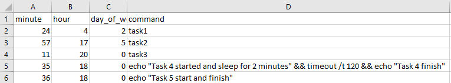
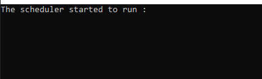
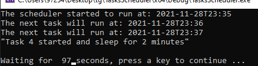
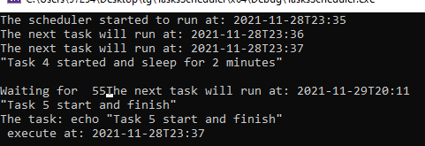
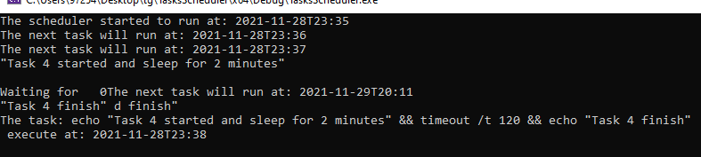

# Task Scheduler
---
System that automatically executes weekly scheduled tasks.

## Description
---
System that automatically executes weekly scheduled tasks,
the system load tasks from CSV file and executes them automatically on their scheduled time.
Task are executed sequentially and if needed simultaneously.

#### Task's strcut example - 
```
typedef struct TASK {
    std::string command;
    cron::cronexpr cron_expression;
    std::time_t next_execution;
    };
}Task;
```
The CSV file has 4 columns representing the execution scheduled time and the execution command.
Value range:
        - Minute: 0-59
        - Hour: 0-23
        - Day of week: 0-6, where 0 = Monday, 6 = Sunday
        - Command: text

#### CSV file structure- 
minute | hour | day_of_week  |  command
------ | ---- |------------  | -------------
24     | 4    |     2        | task1
57     | 17   | 5            | task2
11     | 20   | 0            | task3

## Example

---

#### The time at this run - Sunday 18:34 for CSV the example

####Task  4 and 5 should execute.

#### Scheduler start -
 
#### Task 4 started and changed to sleep for 2 minutes -

#### Task 5 arrive and execute before task 4 - 

#### Task 4 finish his sleep time and executed -

