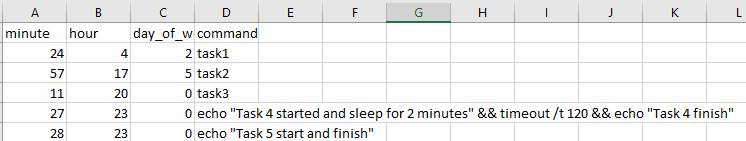
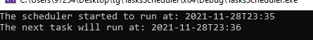

# TasksScheduler

---
TasksScheduler is a system which runs scheduled tasks by using a cron-like pattern

## Description

---
TasksScheduler automatically executes scheduled tasks.
The system loads tasks from a CSV file and executes them automatically when scheduled.
The tasks are executed sequentially and also supports simultaneous executions by using a multithreaded architecture.

#### Task - 
```c++
struct Task {
    std::string command;
    cron::cronexpr cron_expression;
    std::time_t next_execution;
};
```

The CSV file has 4 columns which represent the command and the time in which it needs to be executed.


#### CSV file structure: 
minute | hour | day_of_week  |  command
------ | ---- |------------  | -------------
24     | 4    | 2            | task1
57     | 17   | 5            | task2
11     | 20   | 0            | task3

## Example

---

#### The time at this run - Sunday 18:34 for CSV the example

#### Task 4 and 5 should execute one after the other.

#### Scheduler start:
 
#### Task 4 started and changed to sleep for 2 minutes:

#### Task 5 arrives and executes before task 4: 

#### Task 4 finish its sleep time and executed:


# Dependencies:

---
This project was written using Microsoft Visual Studio 2019 and C++14, other versions may not work.

## Credits:

---
`croncpp.h`: https://github.com/mariusbancila/croncpp